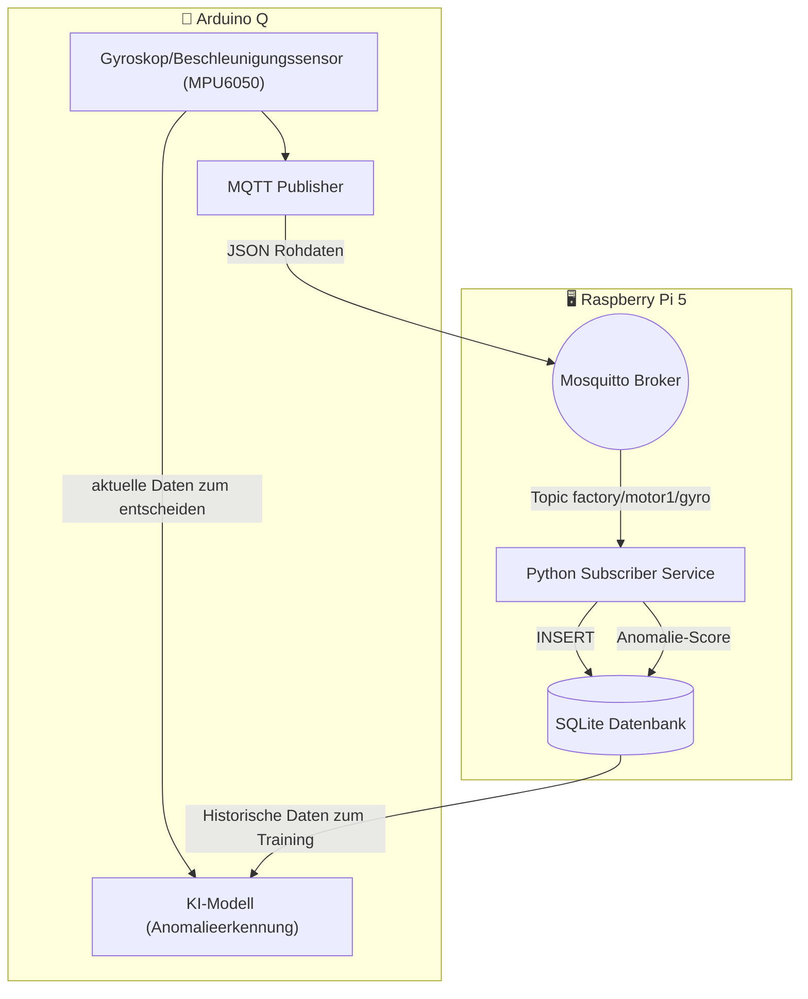
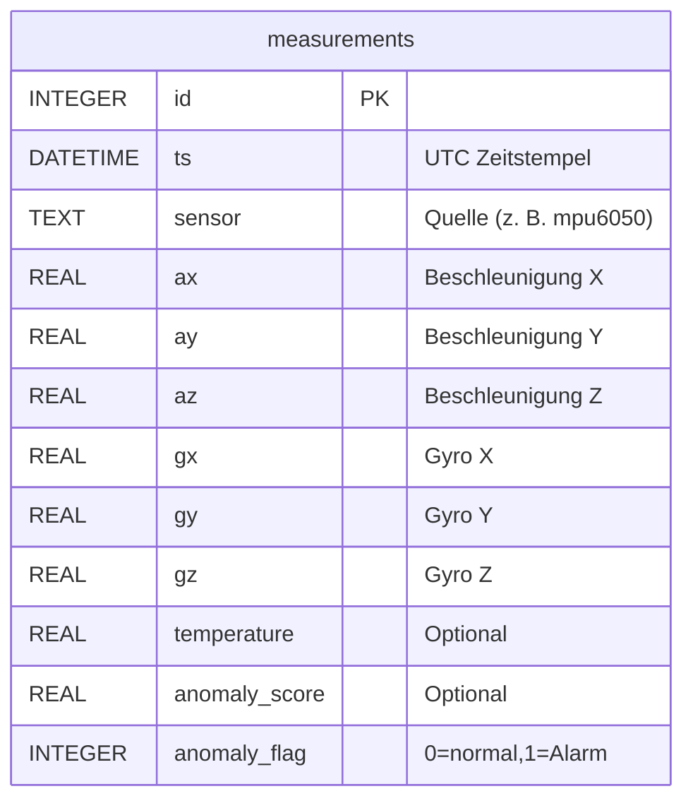

# Datenkrake - MQTT zu SQLite Pipeline

Dieses Projekt sammelt Sensordaten (z. B. vom MPU6050) per MQTT und speichert sie auf dem Raspberry Pi "Datenkrake" in einer SQLite-Datenbank. Ein Python-Subscriber verarbeitet die Nachrichten und ergänzt optional Anomalie-Scores.

## Komponenten
- Raspberry Pi mit Mosquitto (Broker) und Python-Subscriber-Service
- Arduino Q als MQTT-Publisher für Sensordaten
- Windows-Client für Tests (mosquitto_pub, mosquitto_sub)
- SQLite-Datenbank zur Langzeitablage und Modell-Training

### Architekturübersicht



## MQTT Topics
- factory/motor1/gyro - Rohdaten (JSON, optional mit anomaly_score und anomaly_flag)

## Python Subscriber (Service)
- Hört auf das Topic, parsed JSON und schreibt Datensätze in data.db
- Nutzt paho-mqtt und sqlite3
- Wird als systemd-Service (datenkrake.service) betrieben

## SQLite Schema
Aktuelle Tabellenstruktur: measurements enthält Messwerte und optionale Inferenz-Ergebnisse.

```sql
CREATE TABLE IF NOT EXISTS measurements (
	id INTEGER PRIMARY KEY AUTOINCREMENT,
	ts DATETIME NOT NULL,
	sensor TEXT NOT NULL,
	ax REAL NOT NULL,
	ay REAL NOT NULL,
	az REAL NOT NULL,
	gx REAL NOT NULL,
	gy REAL NOT NULL,
	gz REAL NOT NULL,
	temperature REAL,
	anomaly_score REAL,
	anomaly_flag INTEGER DEFAULT 0
);
CREATE INDEX IF NOT EXISTS idx_measurements_ts ON measurements (ts);
CREATE INDEX IF NOT EXISTS idx_measurements_sensor ON measurements (sensor);
```

### ER-Modell



## Betrieb
1. Mosquitto-Konfiguration in /etc/mosquitto/conf.d/datenkrake.conf
2. Subscriber-Code in /home/datenkrake/app/subscriber.py
3. Systemd-Service aktivieren: sudo systemctl enable --now datenkrake
4. Datenprüfung: sqlite3 /var/lib/datenkrake/data.db "SELECT * FROM measurements LIMIT 5;"

## Nächste Schritte
- Authentifizierung für Mosquitto reaktivieren (Passwortdatei)
- Mehrere Topics oder Sensoren abbilden (weitere Tabellen oder sensor-Spalte nutzen)
- Anomalie-Modelle trainieren und periodisch aktualisieren
