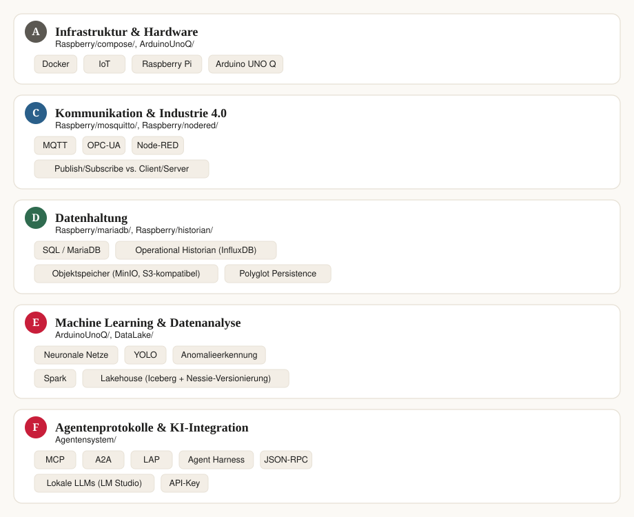
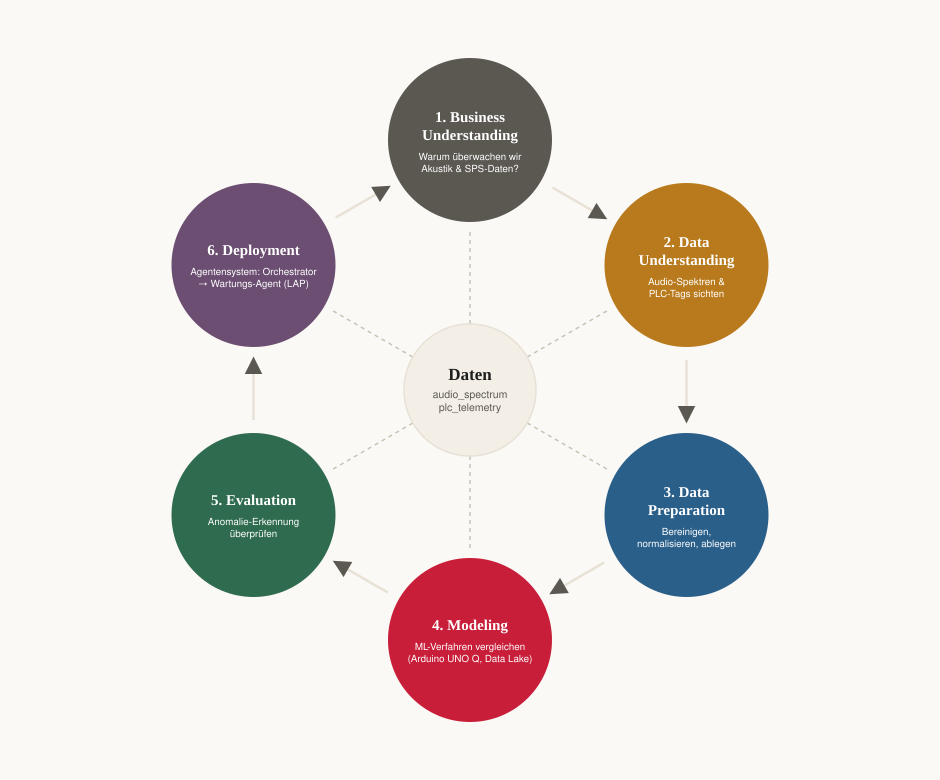
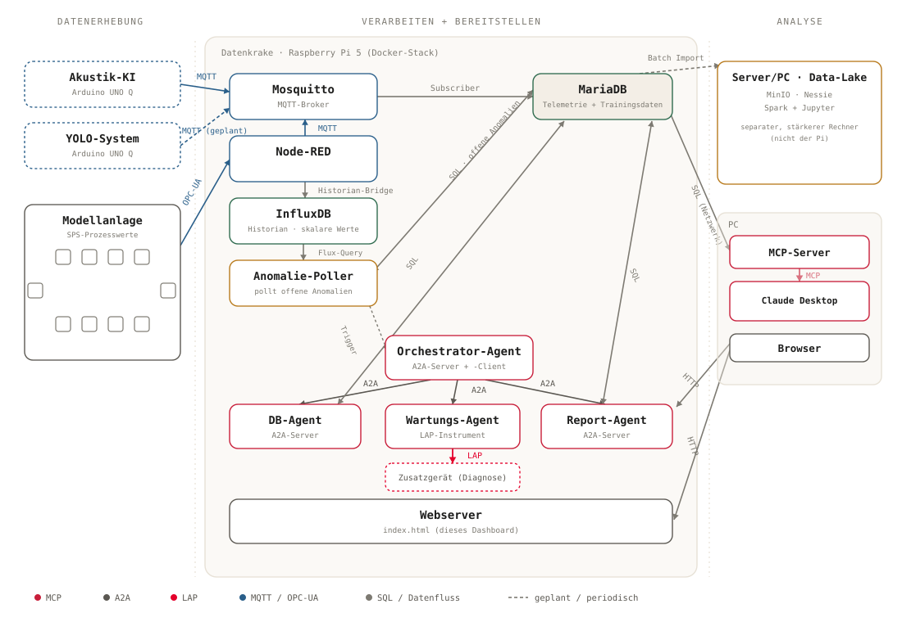

# Datenkrake — Agentensystem (MCP · A2A · LAP)

Dieser Branch (`feature/agentensystem-mcp-a2a-lap`) baut auf dem
IoT-Grundstack der Datenkrake auf (Audioerfassung, MQTT, MariaDB,
Web-Dashboard) und erweitert ihn um eine industrielle SPS-Anbindung
(OPC-UA/Node-RED), einen Operational Historian, einen Data-Lake-Stack
sowie ein **Agentensystem**, das drei KI-Agentenprotokolle an einer
realen Lernanlage demonstriert:

- **MCP** (Model Context Protocol) — verbindet ein Sprachmodell (Claude
  Desktop) mit Werkzeugen und Daten.
- **A2A** (Agent-to-Agent) — verbindet eigenständige Agenten
  miteinander (Orchestrator delegiert an DB- und Report-Agent).
- **LAP** (Local Agent Protocol) — verbindet einen Agenten mit einem
  physischen Zusatzgerät (Wartungs-Agent), inklusive expliziter
  Sicherheitsbestätigung vor jeder Aktion.
- **Agent Harness** — die Tool-Aufruf-Schleife, die aus einem rohen
  Sprachmodell (lokal via LM Studio) überhaupt erst einen Agenten macht.

Die interaktive Dokumentation und der Live-Leitstand liegen in
[`index.html`](Raspberry/web/index.html): Architekturdiagramme, Agenten-Konsole,
Vergleich der ML-Verfahren, OPC-UA-Signaldokumentation der Modellanlage
und ein Quiz zum Gelernten — jeweils mit Verweisen auf die zugehörigen
Ordner im Repo.



*Themen auf einen Blick — hier in fünf Blöcken gebündelt; im Leitstand
(siehe unten) ist „Datenerhebung" als eigener, sechster Themenblock
zusätzlich ausdifferenziert.*

## Zugrunde liegendes Vorgehensmodell: CRISP-DM

Dem gesamten Projekt liegt das **CRISP-DM**-Modell (Cross-Industry
Standard Process for Data Mining) zugrunde. Die Datenkrake ist damit
nicht nur ein IoT-Stack, sondern ein durchgehendes Beispiel für den
klassischen Data-Mining-Kreislauf, angewendet auf echte Akustik- und
SPS-Daten:

1. **Business Understanding** — Warum überwachen wir Akustik- und
   SPS-Daten? Ziel: frühzeitige Anomalieerkennung an der Modellanlage.
2. **Data Understanding** — Audio-Spektren (`audio_spectrum`) und
   PLC-Tags (`plc_telemetry`) über MQTT/OPC-UA sichten.
3. **Data Preparation** — Werte bereinigen, normalisieren und in
   MariaDB bzw. dem Operational Historian ablegen.
4. **Modeling** — ML-Verfahren vergleichen (Arduino UNO Q, Data-Lake-Stack).
5. **Evaluation** — den Anomalie-Detektor gegen reale Messwerte prüfen.
6. **Deployment** — Ergebnis geht ins Agentensystem: der
   Orchestrator-Agent delegiert per LAP an den Wartungs-Agent.



*Die sechs CRISP-DM-Phasen sind ein Kreislauf statt einer Einbahnstraße:
Evaluation und Deployment liefern neue Erkenntnisse, die wieder ins
Business bzw. Data Understanding zurückfließen.*

## Systemvoraussetzungen (Hardware)

| Komponente | Mindestanforderung | Wofür |
| --- | --- | --- |
| **Raspberry Pi** | Modell 4/5, 4 GB RAM oder mehr, Raspberry Pi OS (64-Bit) | zentraler Edge-Server: Docker-Stack mit MQTT, MariaDB, InfluxDB, Node-RED, Web-Dashboard |
| **SD-Karte** | mind. 16 GB (mehr für längeres Logging) | Systemlaufwerk des Pi |
| **SSD (M.2, passend zum Pi)** | empfohlen, z. B. per M.2-HAT/USB3 | InfluxDB schreibt sehr häufig kleine Datenpunkte; auf einer SD-Karte nutzt das die Flash-Zellen spürbar stärker ab und ist langsamer als auf einer SSD. Für Dauerbetrieb daher ratsam, zumindest für `Raspberry/historian/` und die Docker-Volumes |
| **Internetverbindung** | für den Pi während der Installation | Docker-Installation, Image-Pull |
| **Arduino UNO Q** | mit USB-Mikrofon/Webcam | Audio-Erfassung, FFT, lokale KI-Inferenz (Edge AI); Anschluss nur über PD-fähige Dockingstation, siehe Reihenfolge unten |
| **SPS-Modellanlage** (optional) | z. B. S7-1500/ET200SP mit OPC-UA-Freigabe, 10 Stationen im Anlagen-Netz `192.168.36.0/24` | reale Prozesswerte via OPC-UA → Node-RED. Ohne echte Anlage übernimmt der mitgelieferte `opcua_demo_server` einen simulierten Tag |
| **Windows-/Linux-PC oder Laptop** | mit Claude Desktop | MCP-Client, Anzeige des Leitstands, Bedienung der Agenten-Konsole |
| **Optionaler zweiter Rechner** (Schulserver/Lehrer-PC) | mehrere GB freier RAM | eigenständiger Data-Lake-Stack (MinIO, Nessie, Spark/Jupyter) — bewusst **nicht** auf dem Pi, da deutlich ressourcenhungriger |
| **LM Studio** (optional) | beliebiger Rechner mit genug RAM/VRAM für ein lokales LLM | Agent Harness (lokales Sprachmodell statt Claude) |
| **Netzwerk** | Ethernet zum Anlagen-Netz + optional WLAN als Client in ein bestehendes DMZ-Netz | Pi verbindet Anlagen-Netz und DMZ, ist dabei aber **kein eigener Access Point** |

Beim Anschluss von USB-Mikrofon/Webcam über eine Dockingstation auf
Reihenfolge achten: **zuerst** Dockingstation an Strom, **dann** Webcam an
die Dockingstation, **zuletzt** Arduino UNO Q an die Dockingstation — erst
dann meldet sich die Dockingstation korrekt als USB-Hub/Host an.

## Schnellstart: Klonen, Installieren, Updaten

1. **Repository auf den Raspberry Pi klonen:**

   ```bash
   git clone --branch feature/agentensystem-mcp-a2a-lap https://github.com/FlowTheTensor/Datenkrake.git
   cd Datenkrake-Container
   ```

2. **Erstinstallation** — Setup-Skript im Ordner `Raspberry/` mit Root-Rechten ausführen:

   ```bash
   cd Raspberry
   sudo ./setup_iot_stack.sh
   ```

   Das Skript installiert Docker und Docker Compose (falls nicht
   vorhanden), legt die benötigten Verzeichnisse/Volumes an, baut die
   Container-Images und startet den kompletten Stack.

3. **Bestehende Installation aktualisieren** — nach einem `git pull` auf
   dem Pi im selben Ordner:

   ```bash
   sudo ./update_iot_stack.sh
   ```

   Aktualisiert Container-Images, spielt neue (wiederholbare)
   MariaDB-Schema-Änderungen ein und aktualisiert die Node-RED-Eingabeliste,
   ohne bestehende Daten oder aktive Node-RED-Flows zu überschreiben.
   Mit `--sync-nodered-flow` wird zusätzlich die im Repo mitgelieferte
   Flow-Vorlage aktiviert (vorheriges Backup des Node-RED-Datenordners
   inklusive).

4. **Web-Oberflächen öffnen:**
  - `http://datenkrake.local` — Leitstand (`index.html`, siehe unten)
  - `http://datenkrake.local/audiodaten.php` — Audio-Live-Dashboard
  - `http://datenkrake.local/plcdaten.php` — PLC-Telemetrie-Übersicht
   - `http://datenkrake.local:1880` — Node-RED-Editor

   Container-Status lässt sich jederzeit mit `docker compose ps` im Ordner
   `Raspberry/compose` prüfen.

5. **Agentensystem aktivieren** (optional, siehe
   [`Agentensystem/README.md`](Agentensystem/README.md) für Details):
   - `.env` aus `Agentensystem/.env.example` anlegen und anpassen.
   - Python-Umgebung für die Agenten einrichten (`python -m venv .venv && pip install -r requirements.txt`).
   - MCP-Server für Claude Desktop wie in
     [`MCPLokalClaudDesktop/`](MCPLokalClaudDesktop) beschrieben konfigurieren.

## Architekturübersicht



Links erheben Akustik-KI und (geplant) YOLO-System per MQTT sowie die
Modellanlage per OPC-UA über Node-RED die Rohdaten. In der Mitte bündelt
die Datenkrake auf dem Raspberry Pi 5 als Docker-Stack Mosquitto,
Node-RED, InfluxDB, MariaDB, den Anomalie-Poller sowie das Agentensystem
(Orchestrator-, DB-, Wartungs- und Report-Agent, verbunden per A2A); der
Wartungs-Agent greift per LAP ausschließlich auf sein eigenes
Diagnosegerät zu, nie auf die Produktionssteuerung. Rechts liest ein
separater, stärkerer Rechner per Batch-Import den Data-Lake-Stack aus der
MariaDB, während ein MCP-Server auf einem PC dieselbe MariaDB abfragt und
die Daten per MCP an Claude Desktop und einen eigenständigen Agent
Harness weiterreicht. Dieselbe Grafik lässt sich interaktiv mit
Detail-Overlay in `index.html` unter „Architektur" ansehen.

## Was das Projekt zeigt

Der Leitstand (`index.html`) gliedert das Projekt in sechs
Themenblöcke, die jeweils Erklärung und laufendes System verbinden:

| Thema | Inhalt | Zugehörige Ordner |
| --- | --- | --- |
| **Infrastruktur & Hardware** | Docker-Container, Raspberry Pi als Edge-Server, Arduino UNO Q für Edge-AI, Netzwerktopologie (Anlagen-Netz + WLAN-DMZ) | `Raspberry/compose/`, `ArduinoUnoQ/` |
| **Datenerhebung** | Akustikdaten (Arduino UNO Q), SPS-Tags der Modellanlage (OPC-UA), Zusammenführung über MQTT/Node-RED | `ArduinoUnoQ/`, `Raspberry/nodered/`, `UAExpertExport/` |
| **Kommunikation & Industrie 4.0** | MQTT als Publish/Subscribe-Protokoll, OPC-UA als Industriestandard, Node-RED als Übersetzer dazwischen | `Raspberry/mosquitto/`, `Raspberry/nodered/` |
| **Datenhaltung und -analyse** | MariaDB als vollständige Quelle, InfluxDB als Operational Historian, Grafana und der Data-Lake-Stack (MinIO/Nessie/Spark) für Auswertung | `Raspberry/mariadb/`, `Raspberry/historian/`, `DataLake/` |
| **Machine Learning** | Vergleich von ML-Verfahren, Anomalie-Detektor aus Akustikdaten, `anomalie_poller` als Brücke zur Agentenkette | `ArduinoUnoQ/`, `Agentensystem/anomalie_poller/` |
| **Agentensysteme & KI-Integration** | MCP, A2A, LAP und Agent Harness im Zusammenspiel, live testbar über die Agenten-Konsole im Leitstand | `Agentensystem/`, `MCPLokalClaudDesktop/` |

Für die vollständige Architekturübersicht (alle Komponenten,
Kommunikationsprotokolle und Richtungen) siehe
[`architektur-komponenten.md`](architektur-komponenten.md).

## Projektstruktur

```text
Raspberry/            IoT-Grundstack (Docker Compose): MQTT, MariaDB, Subscriber,
                       Web-Dashboard, Historian, Grafana, Node-RED, OPC-UA-Demo-Server
ArduinoUnoQ/           Audio-Erfassung, FFT, Web-UI, ML-Training/Inferenz auf dem Arduino UNO Q
UAExpertExport/        OPC-UA-Exporte und Dokumentation der 10 Stationen der Modellanlage
Agentensystem/         MCP-Erweiterung, A2A-Agenten (Orchestrator/DB/Report), LAP-Wartungs-Agent, Agent Harness
MCPLokalClaudDesktop/  MCP-Server für Claude Desktop (lesender Zugriff auf die MariaDB)
DataLake/              eigenständiger Data-Lake-Stack (MinIO, Nessie, Spark/Jupyter) für einen separaten Rechner
Raspberry/web/         interaktiver Leitstand sowie Audio- und PLC-Datenübersichten
```

## Weiterführende Dokumentation

- [`Agentensystem/README.md`](Agentensystem/README.md) — Setup und Umgebungsvariablen des Agentensystems
- [`Agentensystem/agent_harness/README.md`](Agentensystem/agent_harness/README.md) — didaktische Einordnung des Agent Harness
- [`Raspberry/nodered/README.md`](Raspberry/nodered/README.md) — OPC-UA → Node-RED → MQTT
- [`Raspberry/opcua_demo_server/README.md`](Raspberry/opcua_demo_server/README.md) — Testen ohne echte SPS
- [`Raspberry/historian/README.md`](Raspberry/historian/README.md) — Operational Historian (InfluxDB)
- [`DataLake/README.md`](DataLake/README.md) — Lakehouse-Stack (MinIO/Nessie/Spark)
- [`architektur-komponenten.md`](architektur-komponenten.md) — vollständige Komponenten- und Protokollübersicht
