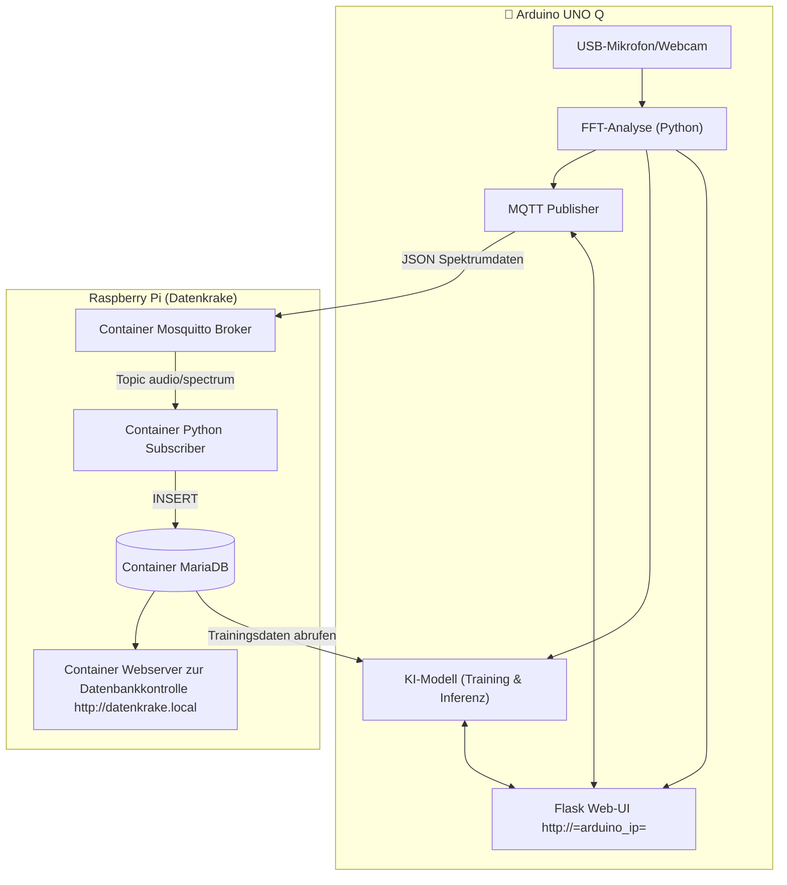
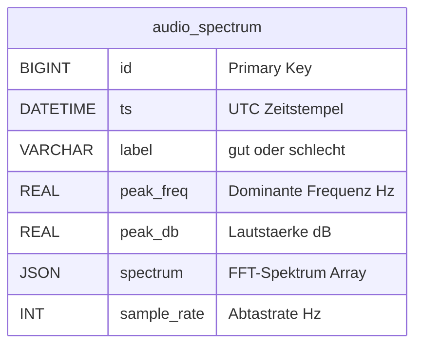

# Datenkrake(Raspberry) sammelt Audiodaten von Arduino UNO Q zum Training eines KI-Modells zur Anomaliererkennung

Dieses Projekt erfasst Audio-Spektrumdaten über ein USB-Mikrofon/Webcam am Arduino UNO Q und sendet sie per MQTT an den Raspberry Pi "Datenkrake". Die Daten werden in einer MariaDB-Datenbank gespeichert und können für ML-Training (Anomalieerkennung) verwendet werden.

## Komponenten
- **Arduino UNO Q**: Erfasst Audio über USB-Mikrofon/Webcam (Linux-Teil), berechnet FFT-Spektrum. Website zur Spektrum-Visualisierung und Datensammlung mit Labels ("gut"/"schlecht"), Training des Modells und Anwendung des Modells
- **Raspberry Pi**: in Containern: Mosquitto MQTT-Broker, MariaDB-Datenbank, Python-MQTT-Subscriber, Webserver zur Datenbankkontrolle


## Installation
### Raspberry Pi
#### Voraussetzungen
- Raspberry Pi (empfohlen: Modell 4 mit 4 GB RAM oder mehr).
- Raspberry Pi OS (64-Bit, basierend auf Debian).
- Internetverbindung für Docker-Installation.
- SD-Karte mit mindestens 16 GB (mehr für längeres Logging).
1. **Repository klonen**: z.B. mit
    ```bash
    git clone https://github.com/FlowTheTensor/Datenkrake-Container.git 
    ```
2. **Script ausführen**: Navigiere zum Projektordner und führe das Setup-Script aus:
   ```bash
   sudo ./setup_iot_stack.sh
   ```
   - Dies installiert Docker und Docker Compose (falls nicht vorhanden).
   - Erstellt notwendige Verzeichnisse und Volumes.
   - Baut die Container-Images und startet die Services.
3. Web-Interface: `http://datenkrake.local`
4. Container prüfen: `docker compose ps`

Speicher: Spektrumdaten sind größer (~2-5 KB pro Datensatz inkl. JSON-Spektrum).
Rate: Typisch 1-5 Spektren pro Sekunde für ML-Datensammlung.
Optimierungen: Bei hoher Last Indizes hinzufügen oder ältere Trainingsdaten archivieren.

### Arduino UNO Q
1. USB-Mikrofon/Webcam anschließen. Wenn Dockingstation verwendet wird, darauf achten, dass sie PD untersützt und die Reihenfolge beim Anstecken beachten. Erst Dockingstation an Strom, dann Webcam an Dockingstation, dann Arduino UNO Q an Dockingstation. Dann meldet sich die Dockingstation als USB-Hub/Host an.
2. Über Arduino App Lab die main.py hochladen und die requirements.txt im Ordner python anlegen und hochladen
3. Per ssh auf den Arduino UNO Q verbinden und in den Ordner der App gehen. Dort in per nano app.yaml den Port 80 in die app.yaml schreiben, da man diese Datei über das Ardunio App Lab leider nicht ändern kann.
4. App (neu-)starten
5. Web-UI öffnen: `http://<arduino-ip>`

### Architekturübersicht



## MQTT Topics
- `audio/spectrum` - Spektrumdaten (JSON mit label, peak_freq, peak_db, spectrum, sample_rate)

## Audio-Datenformat
```json
{
  "label": "gut",
  "peak_freq": 1250.5,
  "peak_db": -25.3,
  "spectrum": [0.1, 0.2, ...],
  "sample_rate": 16000
}
```

## Python-Skript auf Arduino (main.py)
- Erfasst Audio über `arecord` (ALSA)
- Berechnet FFT mit NumPy (16kHz, 2048 Samples)
- Flask Web-UI für Spektrum-Visualisierung und Label-Auswahl
- Sendet Daten über MQTT zum Raspberry Pi
- Läuft auf `http://<arduino-ip>:80`

## MariaDB Schema

```sql
CREATE TABLE IF NOT EXISTS audio_spectrum (
    id BIGINT PRIMARY KEY AUTO_INCREMENT,
    ts DATETIME NOT NULL,
    label VARCHAR(20) NOT NULL DEFAULT 'gut',
    peak_freq REAL NOT NULL,
    peak_db REAL NOT NULL,
    spectrum JSON,
    sample_rate INT DEFAULT 16000
);
```

### ER-Modell




## Tipps
- **Services starten/stoppen**:
  ```bash
  cd compose
  docker compose up -d    # Starten
  docker compose down     # Stoppen
  docker compose ps       # Status prüfen
  ```
- **Logs anzeigen**:
  ```bash
  docker compose logs mqtt    # MQTT-Logs
  docker compose logs db      # DB-Logs
  ```
- **Datenbank verbinden**: Von einem anderen Gerät (z. B. PC im gleichen Netzwerk):
  ```bash
  mysql -h <pi-ip> -P 3306 -u sensor -p telemetry
  ```
- **MQTT testen**: Verwende einen MQTT-Client (z. B. `mosquitto_pub`):
  ```bash
  mosquitto_pub -h <pi-ip> -p 1883 -t "audio/spectrum" -m '{"label":"gut","peak_freq":1250.5,"peak_db":-25.3,"spectrum":[0.1,0.2,0.3],"sample_rate":16000}'
  ```


## Nächste Schritte
- Anomalie-Modell mit gesammelten Spektrumdaten trainieren
- Echtzeit-Inferenz auf Arduino implementieren
- Alarm-System bei erkannten Anomalien
