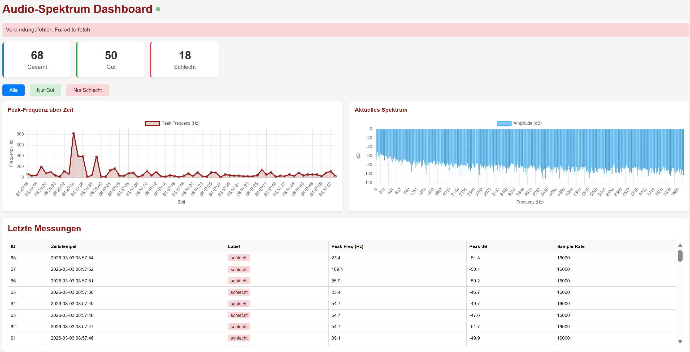
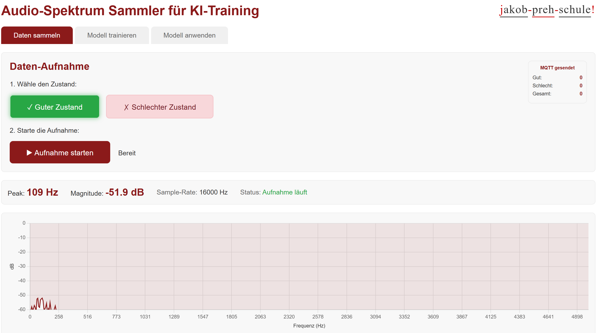
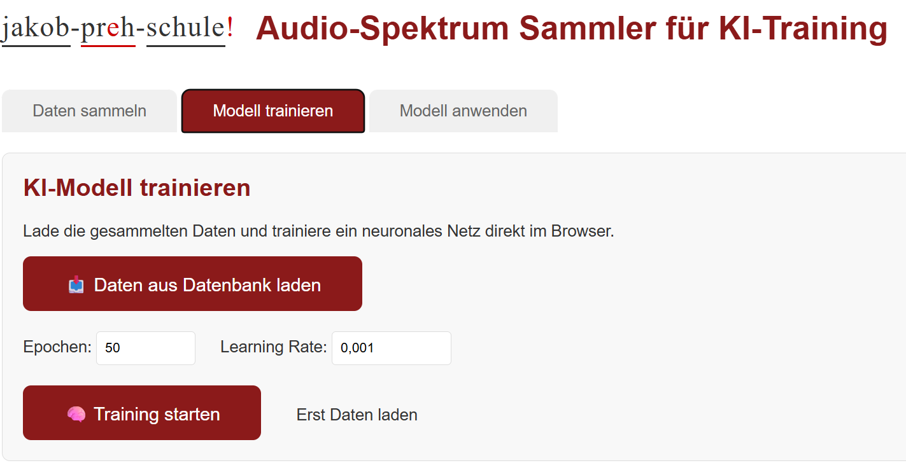
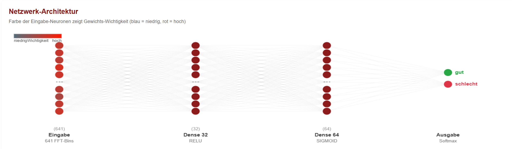
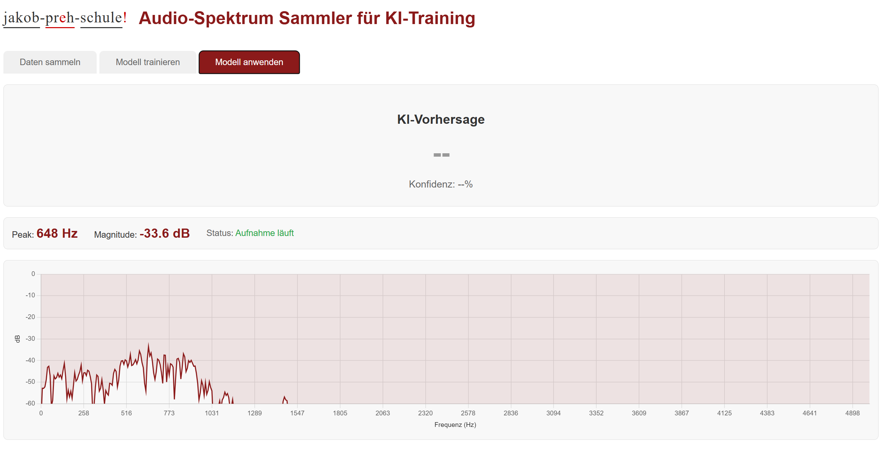
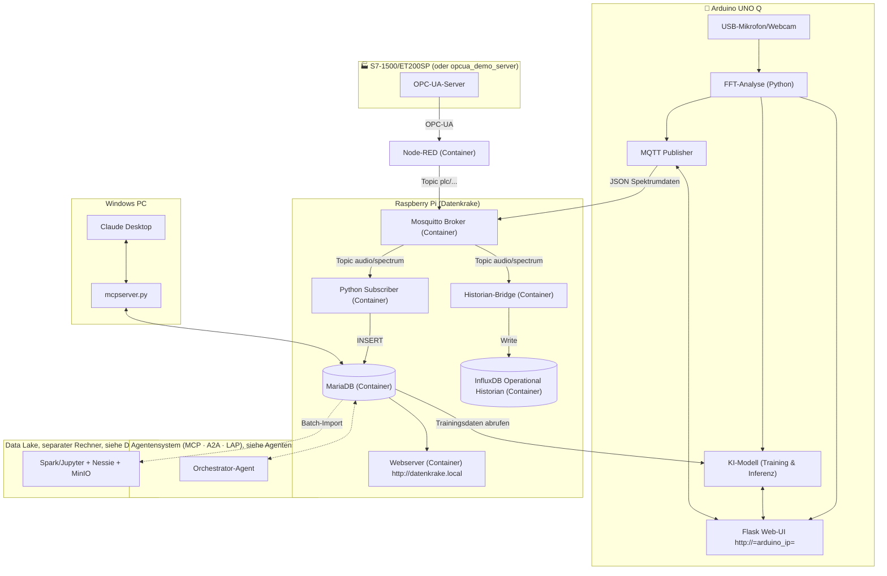
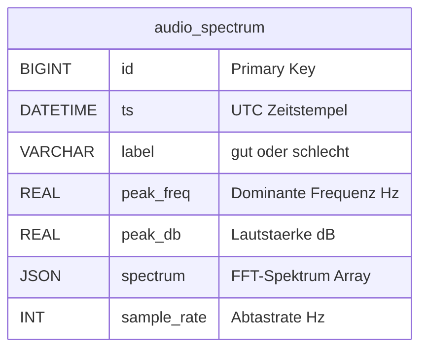
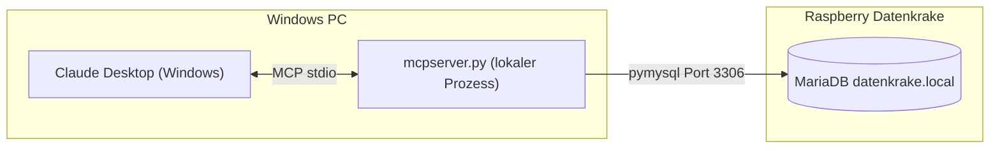

# Datenkrake(Raspberry) sammelt Audiodaten von Arduino UNO Q zum Training eines KI-Modells zur Anomaliererkennung

Dieses Projekt erfasst Audio-Spektrumdaten über ein USB-Mikrofon/Webcam am Arduino UNO Q und sendet sie per MQTT an den Raspberry Pi "Datenkrake". Die Daten werden in einer MariaDB-Datenbank gespeichert und können für ML-Training (Anomalieerkennung) verwendet werden.

## Was kann man mit diesem System im Unterricht behandeln?

Das Projekt ist bewusst so gewachsen, dass sich daran mehrere zusammenhängende
Themenblöcke zeigen lassen – jeweils an echtem, lauffähigem Code statt nur
in der Theorie:


**A) Agentenprotokolle & KI-Integration** ([`Agentensystem/`](Agentensystem/README.md))
MCP (Tools/Resources/Prompts), A2A (Agent Cards, Skills, Tasks), LAP
(Instrument Cards, Reservation, Safety-Fence) – drei Protokolle an
unterschiedlichen "Kanten" (Agent↔Werkzeug, Agent↔Agent, Agent↔Gerät),
plus ein [Agent Harness](Agentensystem/agent_harness/README.md), der
zeigt, was ein LLM überhaupt erst zum Agenten macht.

**B) Machine Learning & Datenanalyse** ([`ArduinoUnoQ/`](ArduinoUnoQ/Python/main.py), [`DataLake/`](DataLake/README.md))
Training eines neuronalen Netzes zur Audio-Klassifikation direkt auf dem
Arduino UNO Q, Anomalieerkennung (statistische Heuristik vs. trainiertes
Modell), und ein Lakehouse (Spark + Iceberg + Nessie) mit Git-artiger
Versionierung von Tabellen.

**C) Datenhaltung** ([`Raspberry/mariadb/`](Raspberry/mariadb/), [`Raspberry/historian/`](Raspberry/historian/README.md))
Relationale Datenbank vs. Operational Historian vs. Objektspeicher – und
die Frage, wann man in der Praxis wirklich mehrere Datenbanktypen
parallel braucht (**Polyglot Persistence**).

**D) Kommunikation & Industrie 4.0** ([`Raspberry/mosquitto/`](Raspberry/mosquitto/), [`Raspberry/nodered/`](Raspberry/nodered/README.md))
MQTT (Publish/Subscribe) vs. OPC-UA (klassischer Industriestandard für
Maschinenkommunikation), verbunden über eine Low-Code-Integration
(Node-RED).

**E) Infrastruktur & Hardware**
Docker/Docker Compose als Grundlage für alle Dienste, IoT-Architektur
allgemein, Raspberry Pi als Edge-Gerät, Arduino UNO Q als Mikrocontroller
mit Linux-Anteil für Edge-KI.

## Systemvoraussetzungen

Nicht jeder Themenblock braucht die volle Ausstattung – für A–D reicht
der Raspberry Pi plus ein beliebiger PC; nur der Data-Lake-Teil (B)
braucht zusätzlich einen stärkeren, separaten Rechner.

### Hardware

| Gerät | Wofür | Mindestanforderung |
|---|---|---|
| **Arduino UNO Q** + USB-Mikrofon/Webcam | Audio-Erfassung, KI-Inferenz vor Ort | wie im Arduino-Teil beschrieben |
| **Raspberry Pi** | Mosquitto, MariaDB, Webserver, Historian, Node-RED | Modell 4 oder 5, **mind. 4 GB RAM** (8 GB empfohlen, sobald Historian/Node-RED mitlaufen), 64-Bit-OS, SD-Karte ≥ 16 GB |
| **PC/Laptop** (beliebiges OS) | Claude Desktop mit MCP, Leitstand-Dashboard im Browser | keine besonderen Anforderungen |
| *Optional:* **separater Rechner** für den Data-Lake-Stack | MinIO, Nessie, Spark/Jupyter | **mind. 8 GB RAM, besser 16 GB** – Spark allein ist schon ressourcenhungrig, siehe [`DataLake/README.md`](DataLake/README.md) |
| *Optional:* Rechner mit **GPU** | spürbar schnellere Antworten eines lokalen LLM über LM Studio | nicht zwingend, aber empfohlen |

Alle Geräte müssen im selben Netzwerk erreichbar sein (mDNS/`.local`-Auflösung wie bei `datenkrake.local`).

### Software

| Werkzeug | Wofür | Hinweis |
|---|---|---|
| **Docker + Docker Compose** | alle Dienste auf Pi und Data-Lake-Rechner | wird von `setup_iot_stack.sh` bei Bedarf mitinstalliert |
| **Python 3.10+** | Agentensystem (MCP-/A2A-SDK, Agent Harness), OPC-UA-Demo-Server | einzelne Container-Dienste (z. B. `subscriber`) bringen ihre eigene, gepinnte Python-Version im Image mit – nur für lokal (nicht containerisiert) ausgeführten Code relevant |
| **git** | Repository klonen und verwalten | |
| **Claude Desktop** | MCP-Server nutzen | siehe Abschnitt "Claude Desktop konfigurieren" weiter unten in diesem README |
| *Optional:* **LM Studio** | lokales LLM für Agent Harness und Dashboard-Chat, ohne API-Key | nur nötig für Themenblock A |
| ein aktueller **Webbrowser** | Leitstand-Dashboard, Node-RED-Editor, InfluxDB-UI, Jupyter, MinIO-Konsole | |

## Komponenten
- **Arduino UNO Q**: Erfasst Audio über USB-Mikrofon/Webcam (Linux-Teil), berechnet FFT-Spektrum. Website zur Spektrum-Visualisierung und Datensammlung mit Labels ("gut"/"schlecht"), Training des Modells und Anwendung des Modells
- **Raspberry Pi**: in Containern: Mosquitto MQTT-Broker, MariaDB-Datenbank, Python-MQTT-Subscriber, Webserver zur Datenbankkontrolle








## Installation
### Raspberry Pi
#### Voraussetzungen

Siehe [Systemvoraussetzungen](#systemvoraussetzungen) oben (Zeile
"Raspberry Pi"). Kurzfassung: Pi 4/5, mind. 4 GB RAM, 64-Bit-OS,
Internetverbindung, SD-Karte ≥ 16 GB.

1. **Repository klonen**: z.B. mit
    ```bash
    git clone https://github.com/FlowTheTensor/Datenkrake-Container.git 
    ```
2. **Script ausführen**: Navigiere zum Projektordner und führe das Setup-Script aus:
   ```bash
   sudo ./setup_iot_stack.sh
   ```
   - Dies installiert Docker und Docker Compose (falls nicht vorhanden).
   - Erstellt notwendige Verzeichnisse und Volumes.
   - Baut die Container-Images und startet die Services.
3. Web-Interface: `http://datenkrake.local`
4. Container prüfen: `docker compose ps`

Speicher: Spektrumdaten sind größer (~2-5 KB pro Datensatz inkl. JSON-Spektrum).
Rate: Typisch 1-5 Spektren pro Sekunde für ML-Datensammlung.
Optimierungen: Bei hoher Last Indizes hinzufügen oder ältere Trainingsdaten archivieren.

### Arduino UNO Q
1. USB-Mikrofon/Webcam anschließen. Wenn Dockingstation verwendet wird, darauf achten, dass sie PD untersützt und die Reihenfolge beim Anstecken beachten. Erst Dockingstation an Strom, dann Webcam an Dockingstation, dann Arduino UNO Q an Dockingstation. Dann meldet sich die Dockingstation als USB-Hub/Host an.
2. Über Arduino App Lab die main.py hochladen und die requirements.txt im Ordner python anlegen und hochladen
3. Per ssh auf den Arduino UNO Q verbinden und in den Ordner der App gehen. Dort in per nano app.yaml den Port 80 in die app.yaml schreiben, da man diese Datei über das Ardunio App Lab leider nicht ändern kann.
4. App (neu-)starten
5. Web-UI öffnen: `http://<arduino-ip>`

### Architekturübersicht



## MQTT Topics
- `audio/spectrum` - Spektrumdaten (JSON mit label, peak_freq, peak_db, spectrum, sample_rate)
- `plc/<station>/<tag>` - von Node-RED aus OPC-UA veröffentlichte SPS-Werte (siehe `Raspberry/nodered/README.md`)

## Audio-Datenformat
```json
{
  "label": "gut",
  "peak_freq": 1250.5,
  "peak_db": -25.3,
  "spectrum": [0.1, 0.2, ...],
  "sample_rate": 16000
}
```

## Python-Skript auf Arduino (main.py)
- Erfasst Audio über `arecord` (ALSA)
- Berechnet FFT mit NumPy (16kHz, 2048 Samples)
- Flask Web-UI für Spektrum-Visualisierung und Label-Auswahl
- Sendet Daten über MQTT zum Raspberry Pi
- Läuft auf `http://<arduino-ip>:80`

## MariaDB Schema

```sql
CREATE TABLE IF NOT EXISTS audio_spectrum (
    id BIGINT PRIMARY KEY AUTO_INCREMENT,
    ts DATETIME NOT NULL,
    label VARCHAR(20) NOT NULL DEFAULT 'gut',
    peak_freq REAL NOT NULL,
    peak_db REAL NOT NULL,
    spectrum JSON,
    sample_rate INT DEFAULT 16000
);
```

### ER-Modell




## Tipps
- **Services starten/stoppen**:
  ```bash
  cd compose
  docker compose up -d    # Starten
  docker compose down     # Stoppen
  docker compose ps       # Status prüfen
  ```
- **Logs anzeigen**:
  ```bash
  docker compose logs mqtt    # MQTT-Logs
  docker compose logs db      # DB-Logs
  ```
- **Datenbank verbinden**: Von einem anderen Gerät (z. B. PC im gleichen Netzwerk):
  ```bash
  mysql -h <pi-ip> -P 3306 -u sensor -p telemetry
  ```
- **MQTT testen**: Verwende einen MQTT-Client (z. B. `mosquitto_pub`):
  ```bash
  mosquitto_pub -h <pi-ip> -p 1883 -t "audio/spectrum" -m '{"label":"gut","peak_freq":1250.5,"peak_db":-25.3,"spectrum":[0.1,0.2,0.3],"sample_rate":16000}'
  ```

# Datenkrake MariaDB MCP-Server für Claude Desktop

Dieser MCP-Server (Model Context Protocol) ermöglicht Claude Desktop auf einem Windows-PC den lesenden Zugriff auf die MariaDB-Datenbank der Datenkrake (Raspberry Pi).

## Voraussetzungen

- Python 3.10+
- Claude Desktop installiert
- Raspberry Pi mit laufendem IoT-Stack (`datenkrake.local` erreichbar)
- MariaDB Port 3306 im Netzwerk erreichbar

## Installation

```powershell
pip install mcp[cli] pymysql
```

## Claude Desktop konfigurieren

Lokal ein venv anlegen und Pakete aus der requirements.txt installieren.

Datei öffnen: `%APPDATA%\Claude\claude_desktop_config.json`

```json
{
  "mcpServers": {
    "datenkrake": {
      "command": "??\\Datenkrake-Container\\MCPLokalClaudDesktop\\venv\\Scripts\\python.exe",
      "args": [
        "???\\Datenkrake-Container\\MCPLokalClaudDesktop\\mcpserver.py"
      ]
    }
  }
}
```

Pfad ggf. auf das eigene System anpassen. Danach Claude Desktop neu starten.

## Verbindungseinstellungen

Die Verbindungsdaten stehen oben in `mcpserver.py`:

| Variable | Standardwert | Beschreibung |
|----------|-------------|-------------|
| `DB_HOST` | `datenkrake.local` | Hostname des Raspberry Pi |
| `DB_PORT` | `3306` | MariaDB-Port |
| `DB_USER` | `mcp_read` | Nur-Lese-Benutzer |
| `DB_PASSWORD` | `changeMeMcp` | Passwort (bitte ändern!) |
| `DB_NAME` | `telemetry` | Datenbankname |

Der `mcp_read`-User wird automatisch beim ersten Start des IoT-Stacks durch das Init-Skript angelegt (`mariadb/init/00-create-database.sql`).

## Verfügbare Tools

| Tool | Parameter | Beschreibung |
|------|-----------|-------------|
| `get_recent` | `limit` (Standard: 20) | Letzte N Einträge (ohne Spektrum-Array) |
| `get_stats` | – | Statistiken pro Label: Anzahl, Ø Frequenz, Ø Lautstärke, Zeitraum |
| `get_spectrum` | `record_id` | Vollständiger Datensatz inkl. FFT-Array für eine ID |
| `get_table_info` | – | Tabellenstruktur von `audio_spectrum` |
| `query` | `sql` | Freie SELECT/SHOW/DESCRIBE-Abfrage (kein Schreiben möglich) |

## Beispieldialoge mit Claude

> „Zeig mir die letzten 10 Messungen"  
> → Claude ruft `get_recent(limit=10)` auf

> „Wie viele 'gut'- und 'schlecht'-Aufnahmen gibt es?"  
> → Claude ruft `get_stats()` auf

> „Was ist die durchschnittliche Peakfrequenz bei schlechten Aufnahmen?"  
> → Claude nutzt `query()` mit einer passenden SQL-Abfrage

## Architektur



## Troubleshooting

| Problem | Lösung |
|---------|--------|
| `Can't connect to MySQL server` | Pi erreichbar? `ping datenkrake.local` testen |
| `Access denied for user mcp_read` | Passwort in `mcpserver.py` und DB prüfen |
| MCP-Server erscheint nicht in Claude | `claude_desktop_config.json` Syntax prüfen; Claude neu starten |
| `ModuleNotFoundError: mcp` | `pip install mcp[cli]` ausführen |


## Agentensystem (MCP, A2A, LAP)

Ergänzend zum MCP-Server oben gibt es in [`Agentensystem/`](Agentensystem/README.md)
ein Lern-Agentensystem, das drei Agentenprotokolle am Beispiel dieses
Projekts gegenüberstellt:

- **MCP** – der obige `mcpserver.py` für Claude Desktop (erweitert um Resources, Prompt, ein Anomalie-Tool)
- **A2A** – ein Orchestrator-, DB- und Report-Agent, die per Agent-to-Agent-Protokoll zusammenarbeiten
- **LAP** – ein Wartungs-Agent, der bei erkannten Akustik-Anomalien ein eigenes Diagnose-/Schmiergerät ansteuert (Lab Agent Protocol – steuert dabei nie die eigentliche Datenerfassung)
- **Agent Harness** – ein ca. 100 Zeilen kurzes, transparentes Beispiel, das zeigt, was ein LLM erst zu einem Agenten macht: die Tool-Aufruf-Schleife (siehe [`Agentensystem/agent_harness/README.md`](Agentensystem/agent_harness/README.md))

Dazu ein zweites Web-Dashboard unter [`leitstand.html`](leitstand.html)
(verlinkt vom bestehenden Dashboard aus) mit Agent-/Instrument-Cards,
Architekturdiagramm, LLM-Chat und A2A-Konsole.

Details, Setup und ehrliche Einschränkungen: siehe [`Agentensystem/README.md`](Agentensystem/README.md).

## Operational Historian & OPC-UA

`Raspberry/historian/` (InfluxDB) speichert dieselben Audio-Messwerte
zusätzlich in einer auf Zeitreihen spezialisierten Datenbank – neben,
nicht statt der MariaDB (die für das Training weiterhin die einzige
vollständige Quelle bleibt, siehe `Raspberry/historian/README.md`,
Abschnitt "Ist zwei Datenbanken parallel in der Praxis wirklich üblich?").
Für die aktuelle Anlagengröße mit einem Sensor ist der Historian noch
nicht operativ nötig, zahlt sich aber aus, sobald weitere Sensoren/
Stationen dazukommen. `Raspberry/nodered/` liest Tags von einer
OPC-UA-fähigen SPS (S7-1500/ET200SP) und veröffentlicht sie auf dem
bestehenden MQTT-Broker; `Raspberry/opcua_demo_server/` simuliert dafür
eine Gegenstelle, falls keine echte SPS im Netz erreichbar ist.

## Data Lake

Unter [`DataLake/`](DataLake/README.md) liegt ein eigener, vom
Raspberry-Pi-Stack unabhängiger Compose-Stack (MinIO + Nessie + PySpark
in Jupyter), der zeigt, was ein **Lakehouse** mit **Git-artiger
Versionierung von Tabellen** ist – bewusst auf einem separaten,
stärkeren Rechner, da Spark für den Pi zu ressourcenhungrig ist.

## Nächste Schritte
- Anomalie-Modell mit gesammelten Spektrumdaten trainieren
- Echtzeit-Inferenz auf Arduino implementieren (aktuell überbrückt durch eine einfache Statistik-Heuristik, siehe `Agentensystem/anomalie_poller/`)
- Alarm-System bei erkannten Anomalien (ein erster Ansatz dafür läuft bereits über den Orchestrator-/Wartungs-Agent, siehe `Agentensystem/README.md`)

